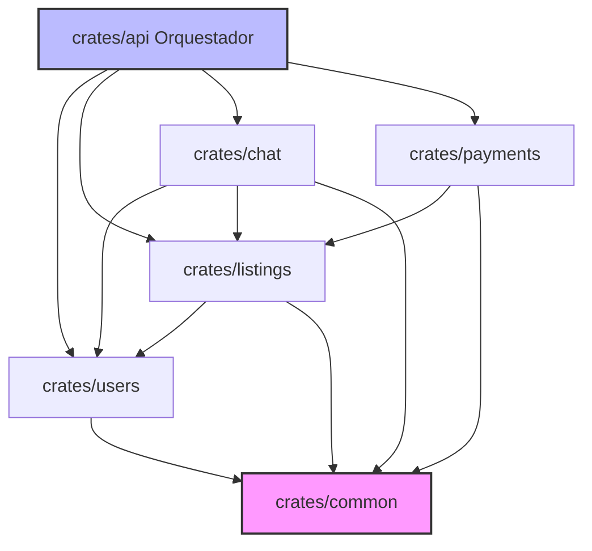

# Cargo Workspace & Hexagonal Modularization — Nebripop

Esta skill define la organización estructural del monorepositorio en Rust de **Nebripop** administrado mediante un **Cargo Workspace**. Se detalla la distribución en crates modulares que implementan Arquitectura Hexagonal (Puertos y Adaptadores), la gestión centralizada de dependencias externas para evitar incoherencias de versiones, la direccionalidad de importaciones permitidas, los flujos de compilación y pruebas aisladas, y el uso de Feature Flags para desarrollo.

---

## 1. Estructura Exacta del Workspace (`Cargo.toml` raíz)

El workspace de Nebripop se compone de **10 crates locales** organizados de forma aislada bajo el directorio `crates/`. El archivo `Cargo.toml` ubicado en la raíz del proyecto es el encargado de declarar la pertenencia y las dependencias comunes.

### `Cargo.toml` en la Raíz del Proyecto
```toml
# Cargo.toml (Raíz del proyecto)
[workspace]
resolver = "2"

members = [
    "crates/api",        # Orquestador del Servidor HTTP (Axum)
    "crates/users",      # Crate de usuarios, perfiles y valoraciones
    "crates/listings",   # Crate de catálogo de anuncios y categorías
    "crates/search",     # Crate de búsquedas geo y Meilisearch
    "crates/chat",       # Crate de bandeja de mensajería y WebSockets
    "crates/payments",   # Crate de transacciones y Stripe
    "crates/ratings",    # Crate de valoraciones y reseñas
    "crates/favorites",  # Crate de favoritos
    "crates/geo",        # Crate de geolocalización y Haversine
    "crates/common",     # Crate compartido de tipos base y utilidades
]

# Gestión centralizada de versiones externas de terceros
[workspace.dependencies]
tokio = { version = "1.38", features = ["full"] }
axum = { version = "0.7.5", features = ["ws", "multipart"] }
sqlx = { version = "0.7.4", features = ["runtime-tokio-native-tls", "postgres", "uuid", "chrono", "decimal"] }
serde = { version = "1.0", features = ["derive"] }
serde_json = "1.0"
uuid = { version = "1.8", features = ["v4", "serde"] }
chrono = { version = "0.4", features = ["serde"] }
rust_decimal = "1.35"
thiserror = "1.0"
async-trait = "0.1"
tracing = "0.1"

# Dependencias locales internas del Workspace
common = { path = "crates/common" }
users = { path = "crates/users" }
listings = { path = "crates/listings" }
geo = { path = "crates/geo" }
```

---

## 2. Gestión Unificada de Dependencias (`workspace.dependencies`)

Para prevenir conflictos graves por versiones inconsistentes entre crates en tiempo de ejecución (como panics por colisión de versiones de la misma librería de base de datos en diferentes crates), **todas las librerías de terceros deben ser declaradas en el `Cargo.toml` raíz bajo `[workspace.dependencies]`.**

### Declaración en los Subcrates (`crates/listings/Cargo.toml`)
Cada subcrate del workspace hace referencia a la versión global definida en la raíz usando la propiedad `{ workspace = true }`.

```toml
# crates/listings/Cargo.toml
[package]
name = "listings"
version = "0.1.0"
edition = "2021"

[dependencies]
# Referencias directas al control de versiones de la raíz
tokio = { workspace = true }
sqlx = { workspace = true }
serde = { workspace = true }
uuid = { workspace = true }

# Dependencias locales del monorrepo
common = { workspace = true }
users = { workspace = true }
```

---

## 3. Regla Estricta de Dependencias (Direccionalidad del Acoplamiento)

Para mantener la Arquitectura Hexagonal y prevenir **dependencias circulares** (que impiden compilar en Rust), Nebripop sigue una regla estricta de direccionalidad de importación.



### Tabla de Acoplamiento Permitido

| Crate | Puede Importar A | Explicación |
|-------|------------------|-------------|
| **`api`** | Todos los crates locales | Orquesta e inicializa las rutas y el estado compartido `AppState`. |
| **`users`** | `common` | Entidad independiente base. |
| **`listings`** | `users`, `geo`, `common` | Relaciona anuncios con su vendedor y geolocalización. |
| **`chat`** | `users`, `listings`, `common` | Relaciona conversaciones con participantes y anuncios. |
| **`payments`** | `listings`, `common` | Relaciona compras con anuncios y precios. |
| **`common`** | Ningún crate local | Debe ser completamente autocontenido. |

---

## 4. Estructura de Archivos Interna de cada Crate (Hexagonal)

Cada subcrate de negocio debe mantener la misma estructura interna de carpetas bajo la Arquitectura Hexagonal (Puertos y Adaptadores):

### Estructura del Crate `listings`
```
crates/listings/
├── Cargo.toml
└── src/
    ├── lib.rs                  # Declaración de submódulos y API pública
    ├── domain/                 # Puertos y Entidades de Negocio
    │   ├── mod.rs
    │   ├── entities.rs         # Struct Listing y Value Objects
    │   └── ports.rs            # Traits abstractos (ListingRepository, etc.)
    ├── application/            # Casos de Uso y DTOs
    │   ├── mod.rs
    │   ├── usecases.rs         # Lógica pura (create_listing_usecase)
    │   └── dtos.rs             # Payloads de entrada y salida
    └── infrastructure/         # Adaptadores Concretos (Infraestructura)
        ├── mod.rs
        └── sqlx_repository.rs  # Implementación del trait con SQLx y Postgres
```

---

## 5. Crate `common`: El Corazón Compartido del Workspace

El crate `common` es la base del monorrepo. Contiene los elementos requeridos de forma transversal por todos los crates locales, eliminando la duplicidad de utilidades comunes.

### Qué se incluye en `common`:
* **Tipos de Datos Base**: Estructuras de paginación (`PageRequest`, `PageResult`).
* **Errores Base**: Definición de `CommonError` y errores de conversión técnicos.
* **Traits Comunes**: Traits de serialización o marcas semánticas.

```rust
// crates/common/src/lib.rs
use serde::{Serialize, Deserialize};

// Paginación Estándar para Nebripop
#[derive(Deserialize, Debug, Clone, Copy)]
pub struct PageRequest {
    pub page: Option<u64>,
    pub limit: Option<u64>,
}

#[derive(Serialize, Debug, Clone)]
pub struct PageResult<T> {
    pub items: Vec<T>,
    pub total: u64,
    pub page: u64,
    pub limit: u64,
}
```

---

## 6. Comandos del Workspace (Compilación y Tests Aislados)

Cargo permite interactuar con un crate específico en lugar de compilar o testear todo el monorrepo a la vez. Esto ahorra tiempos de compilación durante el desarrollo local de Nebripop.

* **Compilar solo un crate específico**:
  `cargo build -p listings`
* **Ejecutar tests unitarios y de integración de un solo crate**:
  `cargo test -p listings`
* **Compilar todo el workspace completo**:
  `cargo build --workspace`
* **Ejecutar todos los tests del workspace**:
  `cargo test --workspace`

---

## 7. Feature Flags para Servicios Externos en Desarrollo

Para facilitar el desarrollo local sin necesidad de interactuar obligatoriamente con pasarelas de pago reales o repositorios en la nube (Stripe, Cloudinary, Meilisearch), configuramos **Feature Flags** en el crate `api` orquestador para activar simuladores (*Mocks*) locales en caliente.

### Configuración en `crates/api/Cargo.toml`
```toml
# crates/api/Cargo.toml
[features]
default = []
stripe-mock = []       # Activa mocks locales de Stripe
cloudinary-mock = []   # Simula subida de imágenes guardando localmente en disco
meili-mock = []        # Simula búsquedas sin servidor Meilisearch levantado
```

### Uso en el Arranque del Servidor (`crates/api/src/main.rs`)
```rust
#[tokio::main]
async fn main() -> Result<(), anyhow::Error> {
    // ...
    
    // Activar condicionalmente adaptadores o mocks por Feature Flags
    #[cfg(feature = "stripe-mock")]
    {
        tracing::warn!("Corriendo Nebripop con Mock de Stripe activo!");
        // Inicializar cliente Mock para pasarela
    }
    
    #[cfg(not(feature = "stripe-mock"))]
    {
        // Inicializar cliente real de Stripe SDK con API KEY
    }
    
    // ...
    Ok(())
}
```

---

## 8. Patrones Correctos vs. Incorrectos (Estructura de Workspace)

### A. Dependencias y Versiones

❌ **Incorrecto (Declarar la versión e inicialización directamente en cada subcrate de forma aislada. Provoca incoherencias de compilación si las versiones difieren)**
```toml
# crates/users/Cargo.toml
[dependencies]
sqlx = { version = "0.7.2", features = ["postgres"] } # Versión 0.7.2

# crates/listings/Cargo.toml
[dependencies]
sqlx = { version = "0.7.4", features = ["postgres"] } # ¡Versión 0.7.4! Conflicto grave
```

✅ **Correcto (Centralizar la versión en `Cargo.toml` de la raíz del monorrepo)**
```toml
# Cargo.toml (Raíz)
[workspace.dependencies]
sqlx = { version = "0.7.4", features = ["postgres"] }

# crates/users/Cargo.toml
[dependencies]
sqlx = { workspace = true } # Garantía total de consistencia
```

---

### B. Referencias Directas entre Crates (Circularidad)

❌ **Incorrecto (El crate listings depende de users y users depende de listings para resolver relaciones, provocando error de compilación circular en Cargo)**
```toml
# crates/users/Cargo.toml
[dependencies]
listings = { path = "../listings" } # ¡Dependencia Circular!

# crates/listings/Cargo.toml
[dependencies]
users = { path = "../users" }
```

✅ **Correcto (Desacoplar las relaciones a nivel de dominio mediante IDs Newtype e importar de forma unidireccional)**
```toml
# listings importa a users (unidireccional). Users no sabe nada de listings.
# Las relaciones en la entidad User de listings se definen por UserId(Uuid)
# y no incrustando la estructura User de users directamente.
# En Cargo.toml de listings simplemente agregamos users = { workspace = true }
```

---

## 9. Las 12 Reglas Críticas del Cargo Workspace para Nebripop

1. **Declaración en members**: Todo crate local nuevo añadido a `crates/` debe registrarse obligatoriamente dentro del array `members` del `Cargo.toml` raíz de Nebripop.
2. **Centralización Obligatoria de Versiones**: Está prohibido definir números de versión de crates de terceros en los `Cargo.toml` individuales. Utiliza exclusivamente `{ workspace = true }` referenciado a `[workspace.dependencies]`.
3. **Cero Dependencias Circulares**: Mantén el diseño unidireccional del monorrepo. Ningún subcrate puede importar a otro que a su vez dependa del primero.
4. **Relaciones por Identificador Newtype**: Modela relaciones entre agregados de dominio cruzados únicamente por su Newtype ID (`UserId`) para evitar forzar dependencias complejas y circulares en el workspace.
5. **Autocontención de common**: El crate `crates/common` debe ser 100% autocontenido; no puede depender de ningún otro crate local del workspace.
6. **Estructura Hexagonal Homogénea**: Cada subcrate de negocio debe mantener estrictamente el esqueleto de directorios: `domain/` (puertos y entidades), `application/` (usecases y DTOs) e `infrastructure/` (adaptadores concretos).
7. **Compilación Selectiva en CI**: Configura los pipelines de integración continua y desarrollo local para compilar de forma aislada crates modificados (`cargo build -p <crate_name>`) para optimizar el rendimiento de la build.
8. **Asilamiento de Tests**: Ejecuta los tests de forma dirigida por módulo (`cargo test -p <crate_name>`) para asegurar la velocidad y evitar solapamiento de bases de datos efímeras en paralelo.
9. **Uso de Feature Flags para Mocks**: Implementa flags de compilación opcionales en el orquestador (`stripe-mock`, `cloudinary-mock`, `meili-mock`) para acelerar el desarrollo ágil en local sin depender de redes de servicios externos.
10. **Precompilados Compartidos**: Todos los subcrates del workspace deben compartir el mismo directorio de salida de compilados (`target/` ubicado únicamente en la raíz del proyecto) para reducir el almacenamiento.
11. **Exposición Restringida mediante lib.rs**: Expón públicamente en `lib.rs` de cada crate solo los DTOs de aplicación y los puertos de dominio necesarios; mantén los adaptadores de infraestructura privados al crate.
12. **Resolver Edición 2021**: Asegura que el `resolver = "2"` y la edición `edition = "2021"` estén declarados uniformemente en todos los manifiestos del workspace para una correcta resolución de macros asíncronas y de SQLx.
