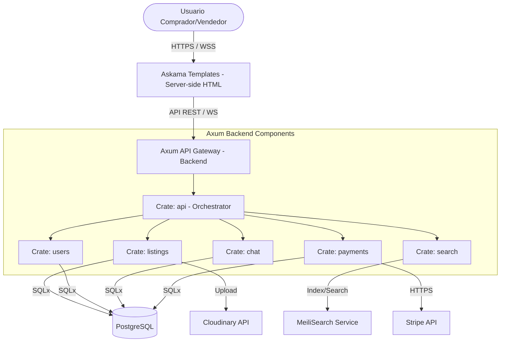

# Skill de Generación de Arquitectura — Nebripop

Esta skill proporciona las directrices, plantillas y estructuras exactas que el `architect-agent` debe seguir para generar el archivo `docs/architecture.md`. Este documento será la **referencia técnica única y absoluta (Single Source of Truth)** para todos los demás agentes de desarrollo que implementen el código en fases posteriores.

---

## Directrices de Calidad y Formato

Al utilizar esta skill, el agente debe regirse por los siguientes principios:

1. **Cero Placeholders y Código Incompleto**: Toda tabla, endpoint, clase, relación o flujo debe documentarse por completo. No se permite el uso de `"..."`, `"por implementar"`, o `"etc."`.
2. **Idioma**: Todo el documento `docs/architecture.md` debe redactarse en **español técnico**, manteniendo los términos del stack en inglés (ej: *crates*, *endpoints*, *handlers*, *middleware*).
3. **Diagramas**: Los diagramas de arquitectura y secuencia deben representarse en texto limpio/ASCII o utilizando la sintaxis de **Mermaid.js** bien formateada, garantizando legibilidad inmediata.
4. **Coherencia Absoluta**: El diseño debe alinearse al 100% con `docs/PRD.md` y `project-context.md` (arquitectura hexagonal en Rust, Axum, PostgreSQL, Askama templates, Stripe, MeiliSearch, Cloudinary, y WebSockets).

---

## Estructura Requerida para `docs/architecture.md`

El documento generado debe incluir obligatoriamente las siguientes 7 secciones detalladas:

### 1. Diagrama C4 Nivel Contenedor (Contexto $\rightarrow$ Contenedores $\rightarrow$ Componentes)

Debe guiar la creación de una vista arquitectónica que muestre el flujo desde el usuario hasta los servicios externos:

- **Contexto de Sistema**: Mostrar cómo interactúan los actores (Usuario Anónimo, Usuario Registrado Comprador/Vendedor, Administrador) con el sistema Nebripop y cómo este se conecta a las APIs externas (Stripe, Cloudinary, MeiliSearch).
- **Contenedores**: Detallar los límites físicos del software:
  - **Askama**: templates HTML server-side renderizados por Axum, con estilos vía TailwindCSS CDN e interactividad en JavaScript vanilla.
  - **Axum API Backend**: Servidor HTTP asíncrono y WebSocket en Rust.
  - **PostgreSQL Database**: Persistencia relacional de datos.
  - **MeiliSearch Engine**: Motor de búsqueda rápida.
  - **Stripe & Cloudinary**: APIs en la nube.
- **Componentes (Crates Hexagonales)**: Dentro del contenedor del backend, estructurar la separación modular por crates en el workspace Cargo.

*Ejemplo de representación C4 sugerida en Mermaid:*


---

### 2. Decisiones de Arquitectura (ADR - Architecture Decision Records)

El documento debe incluir un registro de decisión por cada componente técnico crítico definido en el contexto del proyecto. Cada registro debe seguir la plantilla estándar:
- **Título**: `ADR-XX: [Decisión]`
- **Estatus**: `Aceptado`
- **Contexto**: Explicar la necesidad de negocio o técnica (ej: requerimiento de velocidad, entrega en 1 semana, etc.).
- **Decisión**: Justificar la elección del componente y por qué es el óptimo.
- **Consecuencias**: Beneficios y contras o trade-offs (ej: mayor tiempo de compilación en Rust, curva de aprendizaje del sistema de tipos, etc.).

Se deben documentar las **8 decisiones técnicas clave**:
1. **Rust, Axum & Tokio**: Para el servidor backend altamente concurrente y rápido.
2. **Askama + TailwindCSS CDN + JS Vanilla**: Para un frontend server-side rendered, rápido de compilar y sin complejidad WASM: templates HTML tipados compilados en tiempo de compilación por Askama, estilos con TailwindCSS via CDN y mínima interactividad con JavaScript vanilla.
3. **PostgreSQL con SQLx**: Para persistencia robusta y validación de consultas SQL en tiempo de compilación.
4. **JWT (jsonwebtoken) & Argon2**: Para sesiones sin estado y hashing de seguridad OWASP.
5. **MeiliSearch**: Para búsquedas full-text ultrarrápidas con tolerancia a fallos ortográficos.
6. **Stripe**: Para procesamiento de transacciones financieras seguro y cumplimiento de PCI-DSS.
7. **Cloudinary**: Para gestión, almacenamiento y redimensionamiento dinámico de imágenes C2C.
8. **WebSockets (tokio-tungstenite)**: Para chat interactivo bidireccional en tiempo real con baja latencia.

---

### 3. Estructura de Crates del Workspace Cargo

Detallar cómo se configura el multi-crate workspace en Cargo, la distribución de responsabilidades en la arquitectura hexagonal (Ports & Adapters) y la declaración de dependencias mutuas.

- **Estructura del directorio**:
  ```text
  ├── Cargo.toml (Workspace config)
  ├── crates/
  │   ├── api/          (Axum entrypoint, routers, middlewares, HTTP adapters)
  │   ├── users/        (Dominio, puertos y adaptadores de persistencia de usuarios/auth)
  │   ├── listings/     (Dominio de anuncios e imágenes, adapters Cloudinary y Postgres)
  │   ├── search/       (Dominio de indexación y búsqueda, adapter MeiliSearch)
  │   ├── chat/         (Dominio de mensajería, WebSocket handlers, adapters Postgres)
  │   └── payments/     (Dominio de pagos, adapter Stripe y gestión de webhooks)
  ```

- **Mapeo Hexagonal**: Para cada uno de los crates de dominio (`users`, `listings`, etc.), especificar los subdirectorios:
  - `domain/`: Modelos de datos de negocio y lógica pura.
  - `ports/`: Traits que definen las operaciones (ej: `UserRepository`, `PaymentGateway`).
  - `adapters/`: Implementaciones concretas de los puertos (ej: `PostgresUserRepository` con SQLx, `StripePaymentGateway` con stripe-rust).

---

### 4. Contratos de API (OpenAPI Simplificado)

El documento debe definir de forma estricta los **17 endpoints** exigidos por el PRD. Para cada endpoint se debe detallar:
1. **Método HTTP y Ruta**
2. **Nivel de Acceso** (Anónimo, Comprador, Vendedor, Administrador)
3. **Payload (Request Body)** en formato JSON con tipos exactos.
4. **Parámetros de Query** (si aplica)
5. **Respuestas de Éxito y Error** (HTTP Status, esquemas JSON y códigos de error específicos).

#### Endpoints a documentar exhaustivamente:
- **Autenticación y Usuarios**:
  - `POST /auth/register` — Registro (email, password, display_name)
  - `POST /auth/login` — Login (email, password) $\rightarrow$ Retorna JWT
  - `GET /users/:id` — Perfil público de cualquier usuario
  - `PUT /users/me` — Modificar perfil del usuario autenticado
  - `DELETE /users/:id` — Bloqueo de usuario (Solo Admin)
- **Anuncios (Listings)**:
  - `GET /listings` — Obtener listado general (paginado)
  - `GET /listings/:id` — Detalle completo de un anuncio
  - `POST /listings` — Crear anuncio (título, descripción, precio, categoría, estado, coordenadas, imágenes en Cloudinary)
  - `PUT /listings/:id` — Editar anuncio (Solo Propietario o Admin)
  - `DELETE /listings/:id` — Eliminar o archivar anuncio (Solo Propietario o Admin)
- **Búsqueda (Search)**:
  - `GET /search` — Búsqueda libre con MeiliSearch (q, category, min_price, max_price, lat, lon, max_distance)
- **Mensajería (Chat)**:
  - `POST /chat` — Iniciar conversación o enviar mensaje
  - `GET /chat` — Listar conversaciones del usuario autenticado (con contador de no leídos)
  - `GET /chat/:id/messages` — Historial de mensajes de una conversación
- **Transacciones y Valoraciones (Payments & Ratings)**:
  - `POST /payments` — Iniciar intención de pago con Stripe para un listing
  - `POST /ratings` — Valorar a un usuario tras una transacción (1-5 estrellas + comentario)
  - `POST /favorites` — Guardar/quitar de favoritos (Toggle)
- **Administración**:
  - `GET /admin` — Panel con métricas y reportes globales (Solo Admin)

---

### 5. Esquema de Base de Datos y Relaciones

El documento de arquitectura debe contener la especificación a nivel físico del esquema de la base de datos PostgreSQL, mapeando de forma unívoca las **8 entidades del PRD**:

1. `users`: Datos de usuario, credenciales hasheadas, ubicación y reputación agregada.
2. `listings`: Datos del artículo en venta, precio, estado y ubicación física.
3. `listing_images`: URLs de Cloudinary asociadas a un anuncio con orden de visualización.
4. `conversations`: Cabecera de chat entre comprador y vendedor asociada a un anuncio.
5. `messages`: Mensajes individuales del chat con marca de lectura (`is_read`).
6. `transactions`: Compras y transacciones con estado (`pending`, `paid`, `completed`, `refunded`) y enlace a Stripe.
7. `ratings`: Valoraciones e impresiones emitidas tras una transacción exitosa.
8. `favorites`: Relación M:N de anuncios guardados por usuarios.

#### Requisitos de Especificación:
- Definir de forma precisa cada tabla con sus tipos de datos nativos de PostgreSQL (ej: `UUID`, `VARCHAR(X)`, `NUMERIC(10,2)`, `FLOAT8`, `TIMESTAMPTZ`, `BOOLEAN`).
- Declarar restricciones explicitas: `PRIMARY KEY`, `FOREIGN KEY` (con políticas `ON DELETE CASCADE` o `ON DELETE SET NULL` según corresponda), `UNIQUE` y restricciones `CHECK` (ej. precio > 0, score entre 1 y 5).
- Especificar qué campos deben llevar **índices de base de datos** para optimizar el rendimiento (P95 < 200ms) de consultas frecuentes.
- Incluir un diagrama relacional consolidado (Mermaid o ASCII) que ilustre el flujo de claves foráneas y la cardinalidad de las relaciones.

---

### 6. Flujos de Procesos Complejos

Se deben diseñar y modelar mediante diagramas de secuencia (sintaxis Mermaid o texto ASCII estructurado) el paso a paso detallado, asíncrono y de manejo de errores para los **3 flujos más complejos del sistema**:

#### A. Autenticación (Registro, Login y Validación JWT)
Mapear el ciclo completo:
1. Petición del cliente con datos de entrada.
2. Hasheo con Argon2id (parámetros OWASP recomendados: m=19456, t=2, p=1).
3. Persistencia segura y recuperación en login.
4. Firma del JWT asimétrico o simétrico (HS256) con expiración de 24h.
5. Flujo del Middleware de Axum que intercepta endpoints protegidos, extrae el header `Authorization: Bearer <token>`, valida la firma y el tiempo de expiración, e inyecta el `Extension(CurrentUser)` en los handlers.

#### B. Flujo de Pago con Stripe (Checkout, Webhooks y Persistencia)
Mapear de forma robusta la orquestación:
1. Comprador solicita compra de un listing (`POST /payments`).
2. El backend verifica la disponibilidad del listing (debe estar `active`), calcula tarifas e interactúa con la API de Stripe para generar un `PaymentIntent` y una `Checkout Session`.
3. Retorno de la sesión al cliente y redirección a Stripe Checkout.
4. El comprador completa el pago en la pasarela externa de Stripe.
5. Stripe emite una notificación asíncrona a nuestro endpoint de Webhook (`POST /payments/webhook`).
6. El backend valida criptográficamente la firma del webhook (`Stripe-Signature`), procesa el evento `checkout.session.completed`, actualiza la tabla `transactions` a `paid`, cambia el `status` del anuncio en `listings` a `sold` para retirarlo de búsquedas, y notifica asíncronamente al vendedor a través de WebSockets o notificaciones.

#### C. Flujo de Búsqueda con MeiliSearch e Indexación Asíncrona (con Fallback de BD)
Mapear el desacoplamiento de búsqueda:
1. **Indexación**: Cada vez que se crea, modifica o elimina un anuncio (`listings`), el backend emite una llamada no bloqueante (en un hilo de Tokio asíncrono) al SDK de MeiliSearch para sincronizar el índice de anuncios (`listings_index`).
2. **Consulta**: El comprador realiza una búsqueda (`GET /search`). El backend consulta el motor MeiliSearch aplicando filtros y ordenamiento de geolocalización.
3. **Estrategia de Alta Disponibilidad (Fallback)**: Si el servicio MeiliSearch no está disponible o la petición devuelve un error de conexión, el backend de Axum debe capturar la excepción de forma elegante y reconducir la consulta directamente a PostgreSQL ejecutando una query `SELECT` robusta con cláusulas `ILIKE` y filtros espaciales Haversine en el `WHERE`, garantizando que el usuario siempre reciba resultados válidos.

---

### 7. Estrategia de Despliegue y Configuración

Definir cómo se pondrá en producción la aplicación Nebripop de forma estable y aislada:

- **Estrategia de Contenedores**: Uso de `Dockerfile` multi-stage para compilar el backend de Rust de manera óptima (generando un binario estático ligero en una imagen `alpine` o `distroless`) y servir los templates Askama compilados en el propio binario.
- **Topología de Servicios**:
  - Contenedor Backend Axum con templates Askama (SSR) + TailwindCSS CDN + JS vanilla.
  - Base de datos gestionada PostgreSQL.
  - Instancia MeiliSearch dedicada con volumen persistente.
- **Tabla de Variables de Entorno Obligatorias**:
  Documentar una tabla estricta con todas las variables necesarias en producción, su formato y propósito:
  - `DATABASE_URL`: URL de conexión a PostgreSQL.
  - `JWT_SECRET`: Semilla criptográfica para firma y validación de tokens.
  - `STRIPE_SECRET_KEY`: API Key privada de Stripe.
  - `STRIPE_WEBHOOK_SECRET`: Firma para validar webhooks de Stripe.
  - `MEILI_URL` y `MEILI_KEY`: Endpoint y API Key del motor de búsqueda.
  - `CLOUDINARY_URL`: Configuración del almacén de imágenes.
  - `RUST_LOG`: Nivel de verbosidad del logger (ej: `info`, `warn`).

---

## Plantilla para Invocar al Agente

Cuando guíes al `architect-agent` para generar el documento, proporciónale esta estructura y pídele que se asegure de rellenar cada sección con datos reales, especificaciones rigurosas y diagramas interactivos. El resultado final debe ser guardado estrictamente en [docs/architecture.md](file:///c:/Users/Daniel/Desktop/Curso%20IA%20&%20Big%20Data/Progrmacion%20de%20IA/Nebripop/docs/architecture.md).
