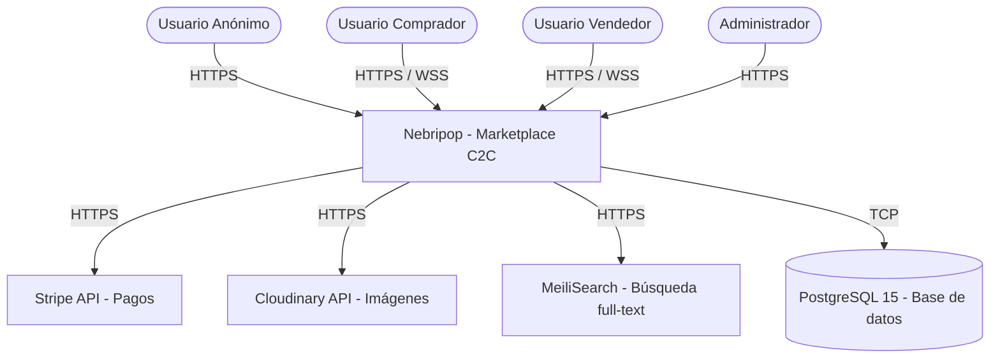
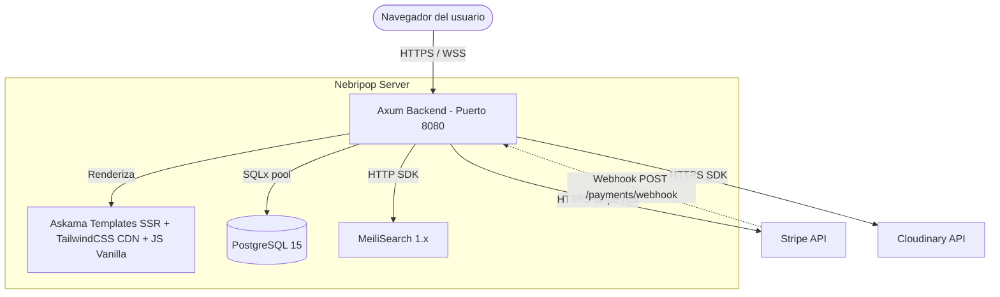
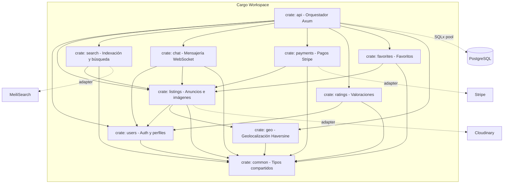

# Arquitectura Técnica — Nebripop

**Versión:** v1.0
**Fecha:** 27 de mayo de 2026
**Autor:** architect-agent
**Fuente de verdad:** Este documento es la referencia técnica única (Single Source of Truth) del proyecto Nebripop.

---

## 1. Diagramas C4

### 1.1 Nivel Contexto — Sistema y actores externos

### 1.2 Nivel Contenedor — Componentes desplegables

### 1.3 Nivel Componente — Crates del workspace Cargo

---

## 2. Decisiones de Arquitectura (ADRs)

### ADR-001: Rust + Axum + Tokio como stack backend

**Estatus**: Aceptado
**Fecha**: 2026-05-27

**Contexto**
Nebripop requiere un backend con alta concurrencia para manejar WebSockets de chat, peticiones REST simultáneas y webhooks de Stripe. El equipo necesita un framework que ofrezca rendimiento nativo, seguridad de memoria sin garbage collector y un ecosistema maduro para APIs HTTP asíncronas. El requisito no funcional del PRD exige P95 < 200ms en endpoints REST y < 100ms en latencia de WebSocket.

**Decisión**
Adoptar Rust como lenguaje principal del backend, Axum 0.7.x como framework web HTTP y WebSocket, y Tokio 1.x como runtime asíncrono. Axum ofrece extractores tipados, integración nativa con Tower middleware, y soporte de WebSockets integrado mediante `axum::extract::ws`. Se descartaron alternativas como Actix Web (API menos ergonómica y macros implícitas) y frameworks en otros lenguajes (Node.js/Express, Go/Gin) por no cumplir simultáneamente los requisitos de rendimiento, seguridad de tipos y validación en tiempo de compilación.

**Consecuencias**
- ✅ Rendimiento nativo sin garbage collector: cumple P95 < 200ms con margen
- ✅ Seguridad de memoria garantizada en compilación (borrow checker)
- ✅ Soporte nativo de WebSockets en Axum sin dependencias adicionales
- ✅ Ecosistema async maduro con Tokio (spawn, select, channels)
- ⚠️ Curva de aprendizaje elevada del sistema de tipos y lifetimes para generación con IA
- ⚠️ Tiempos de compilación más largos que lenguajes interpretados (mitigado con compilación incremental por crate)

---

### ADR-002: Askama templates + TailwindCSS CDN + JavaScript vanilla sobre Leptos/WASM

**Estatus**: Aceptado
**Fecha**: 2026-05-27

**Contexto**
El frontend de Nebripop debe renderizar páginas HTML completas del lado del servidor para optimizar SEO y First Contentful Paint (< 1.5s según PRD). El equipo tiene 1 semana de desarrollo y necesita una solución de frontend que no añada complejidad de build (bundlers, WASM, hydration). Se evaluaron Leptos (framework Rust con WASM), Yew (WASM) y la combinación Askama + TailwindCSS CDN + JS vanilla.

**Decisión**
Usar Askama 0.12.x para templates HTML compilados y validados en tiempo de compilación, TailwindCSS via CDN para estilos responsive sin build step, y JavaScript vanilla para interactividad mínima (formularios, WebSocket client, toggles de favoritos). Askama genera HTML estático embebido en el binario, eliminando la necesidad de un servidor de archivos estáticos separado. Se descarta Leptos/WASM por complejidad de hydration, mayor tamaño de bundle y tiempo de desarrollo incompatible con 1 semana.

**Consecuencias**
- ✅ Templates validados en compilación: errores de tipado detectados antes de ejecutar
- ✅ Zero build step adicional para frontend (no webpack, no Vite, no trunk)
- ✅ First Contentful Paint óptimo: HTML completo en primera respuesta
- ✅ TailwindCSS CDN permite diseño responsive sin configuración local
- ⚠️ Interactividad limitada a JavaScript vanilla (sin estado reactivo en cliente)
- ⚠️ Cada cambio de template requiere recompilación del binario Rust

---

### ADR-003: PostgreSQL + SQLx sobre ORM (Diesel, SeaORM)

**Estatus**: Aceptado
**Fecha**: 2026-05-27

**Contexto**
Nebripop necesita persistencia relacional para 8 entidades con relaciones complejas (usuarios, anuncios, conversaciones, transacciones, valoraciones, favoritos). Se requiere validación de queries SQL en compilación para eliminar errores de runtime, soporte nativo de UUID, TIMESTAMPTZ y NUMERIC, y migraciones versionadas. Se evaluaron Diesel (ORM con DSL propio), SeaORM (ORM async) y SQLx (driver SQL directo con validación en compilación).

**Decisión**
Adoptar PostgreSQL 15+ como motor de base de datos y SQLx 0.7.x como driver asíncrono con validación de queries en compilación. SQLx verifica cada `query!` y `query_as!` contra el esquema real de la base de datos durante `cargo build`, detectando columnas inexistentes, tipos incompatibles y errores de SQL antes del despliegue. Se descartan ORMs por la abstracción innecesaria que imponen sobre queries SQL directas y la pérdida de control fino sobre índices y optimización.

**Consecuencias**
- ✅ Queries SQL validadas contra el esquema real en compilación (zero errores SQL en runtime)
- ✅ Control total sobre queries: optimización manual de JOINs, índices y CTEs
- ✅ Soporte nativo de tipos PostgreSQL: UUID, TIMESTAMPTZ, NUMERIC, FLOAT8, BOOLEAN
- ✅ Migraciones versionadas con `sqlx migrate run` en directorio `/migrations`
- ⚠️ Requiere base de datos accesible durante compilación (solucionable con `sqlx prepare` offline)
- ⚠️ No genera automáticamente structs de entidad: cada modelo se define manualmente

---

### ADR-004: JWT (jsonwebtoken) + Argon2id para autenticación

**Estatus**: Aceptado
**Fecha**: 2026-05-27

**Contexto**
El PRD exige autenticación stateless con tokens que expiren en 24h, hashing de contraseñas con parámetros OWASP (m=19456, t=2, p=1), y validación en cada request protegido mediante middleware de Axum. Se necesita que el sistema funcione sin almacenamiento de sesiones en servidor (sin Redis obligatorio). Se evaluaron sesiones basadas en cookies con almacenamiento servidor, OAuth2 con proveedores externos, y JWT stateless con hashing Argon2id.

**Decisión**
Implementar autenticación mediante JWT con algoritmo HS256 usando el crate `jsonwebtoken` 9.x para generación y validación de tokens, y `argon2` 0.5.x para hashing de contraseñas con Argon2id. El token JWT contiene `user_id` (UUID), `role` (user/admin) y `exp` (expiración 24h). Un middleware de Axum extrae el header `Authorization: Bearer <token>`, valida firma y expiración, e inyecta `Extension(CurrentUser)` en los handlers protegidos. Se descarta OAuth2 externo por complejidad innecesaria para un MVP académico, y sesiones con estado por requerir Redis.

**Consecuencias**
- ✅ Stateless: no requiere almacenamiento de sesiones en servidor ni Redis
- ✅ Argon2id con parámetros OWASP: resistente a ataques de fuerza bruta y side-channel
- ✅ Middleware reutilizable en Axum: una única capa valida todos los endpoints protegidos
- ✅ Token portable: permite autenticar tanto requests HTTP como handshakes WebSocket
- ⚠️ No hay revocación inmediata de tokens (token válido hasta expiración natural de 24h)
- ⚠️ JWT_SECRET debe protegerse estrictamente: si se filtra, todos los tokens son comprometidos

---

### ADR-005: MeiliSearch para búsqueda full-text

**Estatus**: Aceptado
**Fecha**: 2026-05-27

**Contexto**
El PRD exige búsqueda por texto libre con resultados en menos de 300ms (US-07), filtros combinables por categoría, rango de precio y distancia (US-08), y tolerancia a errores tipográficos. PostgreSQL con `ILIKE` no ofrece ranking de relevancia ni typo-tolerance nativo. Se evaluaron Elasticsearch (pesado, JVM, complejo para 1 semana), PostgreSQL full-text search con `tsvector` (limitado en typo-tolerance), y MeiliSearch (ligero, API REST, typo-tolerant por defecto).

**Decisión**
Adoptar MeiliSearch como motor de búsqueda externo usando el crate `meilisearch-sdk` 0.27.x. Los anuncios se indexan asincrónicamente en un índice `listings_index` cada vez que se crean, modifican o eliminan. Las búsquedas del usuario se dirigen a MeiliSearch con filtros de categoría, precio y geolocalización. Si MeiliSearch no está disponible, el backend ejecuta un fallback automático a PostgreSQL con `ILIKE` y filtros `WHERE`.

**Consecuencias**
- ✅ Búsqueda sub-50ms con ranking de relevancia y typo-tolerance automática
- ✅ Filtros faceteados nativos (categoría, precio, geolocalización) sin queries SQL complejas
- ✅ API REST simple con SDK Rust oficial disponible
- ✅ Fallback a PostgreSQL ILIKE garantiza disponibilidad aunque MeiliSearch caiga
- ⚠️ Servicio externo adicional que mantener desplegado y sincronizado
- ⚠️ Indexación asíncrona implica ventana de consistencia eventual (< 5 segundos según PRD)

---

### ADR-006: Stripe para pagos

**Estatus**: Aceptado
**Fecha**: 2026-05-27

**Contexto**
El PRD exige pagos reales con tarjeta (US-17, US-18) con cero datos de tarjeta almacenados en la base de datos del sistema (PCI-DSS compliance). Se necesita crear PaymentIntents, redirigir a Stripe Checkout, y procesar webhooks asincrónicos para confirmar el pago y actualizar el estado de la transacción. Se evaluaron PayPal (API más compleja, peor DX), Stripe (API clara, SDK Rust oficial, modo test gratuito), y procesamiento manual (inviable por compliance).

**Decisión**
Usar Stripe como pasarela de pagos mediante el crate `stripe-rust` 0.34.x. El flujo implementa: (1) el comprador solicita pago via `POST /payments/intent`, (2) el backend crea un PaymentIntent con monto y metadata, (3) el cliente redirige a Stripe Checkout, (4) Stripe notifica via webhook a `POST /payments/webhook`, (5) el backend valida la firma `Stripe-Signature`, actualiza la transacción a `paid` y el listing a `sold`. Se opera en modo test durante desarrollo y se conmuta a modo producción para demo.

**Consecuencias**
- ✅ Cero datos de tarjeta en nuestra BD: compliance PCI-DSS delegado 100% a Stripe
- ✅ SDK Rust oficial (`stripe-rust`) con tipos seguros para PaymentIntent y webhooks
- ✅ Modo test gratuito: permite desarrollo completo sin costes reales
- ✅ Webhooks asíncronos permiten actualización fiable del estado de transacción
- ⚠️ Dependencia de servicio externo: si Stripe cae, los pagos se bloquean
- ⚠️ Validación criptográfica de webhooks añade complejidad al handler

---

### ADR-007: Cloudinary para gestión de imágenes

**Estatus**: Aceptado
**Fecha**: 2026-05-27

**Contexto**
Cada anuncio en Nebripop puede tener múltiples imágenes (tabla `listing_images`). Se necesita almacenamiento escalable, redimensionamiento dinámico (thumbnails, previews) y entrega via CDN para optimizar tiempos de carga. Se evaluaron: almacenamiento local en disco (`/static/uploads/`), Amazon S3 + CloudFront (requiere cuenta AWS y configuración IAM compleja), y Cloudinary (API REST, transformaciones on-the-fly, plan gratuito suficiente para MVP).

**Decisión**
Adoptar Cloudinary como servicio de almacenamiento y transformación de imágenes. Las imágenes se suben via HTTPS desde el crate `listings` al crear o editar anuncios. La URL resultante de Cloudinary se persiste en la tabla `listing_images`. Las transformaciones (resize, crop, formato WebP) se aplican via parámetros en la URL de Cloudinary sin procesamiento local. Si Cloudinary no está disponible, el fallback almacena imágenes localmente en `/static/uploads/` con servido estático desde Axum.

**Consecuencias**
- ✅ CDN global de Cloudinary reduce latencia de carga de imágenes para usuarios
- ✅ Transformaciones dinámicas sin procesamiento local (thumbnails, WebP, crop)
- ✅ Plan gratuito cubre el volumen del MVP (25 créditos/mes, ~25GB almacenamiento)
- ✅ Fallback a almacenamiento local garantiza funcionalidad sin servicio externo
- ⚠️ Dependencia de servicio externo para funcionalidad core (imágenes de anuncios)
- ⚠️ Requiere gestión de API keys y upload presets en la configuración

---

### ADR-008: WebSockets con axum::extract::ws para chat en tiempo real

**Estatus**: Aceptado
**Fecha**: 2026-05-27

**Contexto**
El PRD exige mensajería en tiempo real con latencia < 100ms entre envío y renderizado (US-11). Los mensajes deben persistirse en PostgreSQL y entregarse al destinatario si está conectado, o almacenarse para lectura posterior. Se evaluaron: polling HTTP periódico (latencia alta, tráfico innecesario), Server-Sent Events (unidireccional, no apto para chat), y WebSockets bidireccionales. Para la implementación en Rust se evaluaron `tokio-tungstenite` (bajo nivel) y `axum::extract::ws` (integrado en Axum).

**Decisión**
Implementar chat en tiempo real usando `axum::extract::ws` que proporciona WebSockets integrados en el framework Axum sin dependencias adicionales. El handshake WebSocket requiere un token JWT válido como query parameter (`?token=<jwt>`). Cada conexión activa se registra en un `DashMap<Uuid, Sender>` en el `AppState`, aprovechando la concurrencia lock-free de DashMap para evitar deadlocks y mejorar el rendimiento bajo alta carga. Al recibir un mensaje, el handler lo persiste en PostgreSQL y lo reenvía al destinatario si está conectado. Como fallback, se implementa `GET /chat/:id/messages?since=<timestamp>` para recuperar mensajes via HTTP polling.

**Consecuencias**
- ✅ Latencia sub-100ms: comunicación bidireccional persistente sin overhead HTTP por mensaje
- ✅ Integración nativa con Axum: reutiliza el mismo servidor, middleware y AppState
- ✅ Persistencia dual: cada mensaje se guarda en PostgreSQL y se entrega en tiempo real
- ✅ Fallback HTTP polling garantiza funcionalidad si WebSocket no está disponible
- ✅ DashMap ofrece acceso concurrente sin locks globales y sin riesgo de deadlocks
- ⚠️ Sin pub/sub externo (Redis): limitado a una única instancia del servidor en esta versión
