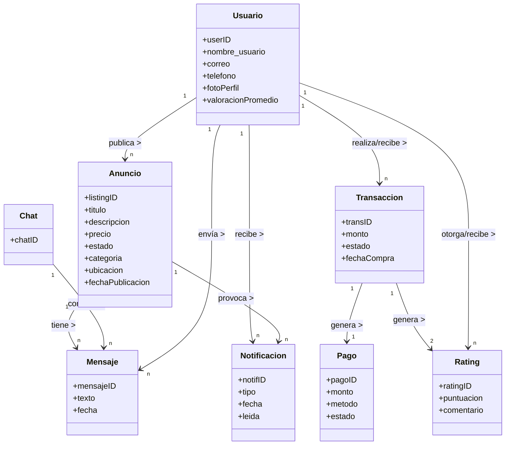

# Análisis de Wallapop como producto digital

**Resumen ejecutivo:** Wallapop es una plataforma de compraventa de segunda mano basada en app móvil y web, que articula múltiples módulos funcionales integrados: gestión de **usuarios**, **anuncios** (listings), **búsqueda** y descubrimiento, **mensajería**, **pagos/cobros**, **valoraciones** y reputación, **notificaciones**, **moderación/seguridad**, **geolocalización/mapas**, **favoritos/seguimiento**, **analítica de ventas**, **configuración/perfil**, **soporte/disputas** e **integraciones** externas (pagos, logística, etc). Cada módulo incluye diversas funcionalidades detalladas, con flujos de usuario y datos asociados. A continuación se describen de forma exhaustiva estos módulos, funciones, flujos, datos, permisos e integraciones clave. 

## Módulos y funcionalidades

| **Módulo**               | **Funcionalidades clave**                                      |
|--------------------------|---------------------------------------------------------------|
| **Usuarios**             | Registro/login (correo, móvil, SSO), gestión de perfil (foto, nombre, descripción, ubicación), ver perfil de otros, ajustes de cuenta, eliminación. |
| **Anuncios**             | Crear/editar/eliminar anuncio (título, fotos, descripción, categoría, precio, estado, envío), gestionar catálogo propio, marcar como vendido, destacar (pago). |
| **Búsqueda y descubrimiento** | Buscador de texto, filtros (categoría, precio, proximidad, estado), búsqueda por imagen, exploración por categorías, visualización en mapa, secciones destacadas. |
| **Mensajería**           | Chat interno entre comprador/vendedor; envío de ofertas y contraofertas; solicitud de compra; comunicación con stickers/archivos; bloqueo de usuarios; historial de conversaciones. |
| **Pagos y cobros**       | Pagos integrados “Wallapop Envíos/Protect” (tarjeta, PayPal) con pasarela segura; pago en persona (dinero efectivo); monedero interno (saldo) y retiro a cuenta bancaria; gestión de comisiones; seguimiento de estado de envío. |
| **Valoraciones/Perfil**  | Calificaciones 1–5 estrellas con comentario tras transacción; reputación pública en perfil; estadísticas (número de ventas, ratio). |
| **Notificaciones**       | Alertas push y en app («Buzón»): nuevos mensajes, ofertas, estados de envío, valoraciones recibidas, ventas completadas, seguidores nuevos, recomendaciones. |
| **Moderación/Seguridad** | Reporte de cuentas y anuncios; política de contenidos (bienes prohibidos/ilegales); bloqueo de usuarios; verificación básica (correo/móvil); revisión de disputas; sistema anti-fraude (ej. detección de links maliciosos). |
| **Geolocalización/Mapas** | Ubicación del usuario y anuncios; filtro por radio de distancia; vista de anuncios en mapa; detección de localidad cercana. |
| **Favoritos/Seguimiento** | Marcar anuncios como favoritos (lista de deseos); seguir usuarios o búsquedas; recibir alerta de nuevas publicaciones de usuarios seguidos o de categorías seguidas. |
| **Analítica (Vendedor)** | Panel de estadísticas de vendedor: visitas a anuncios, interés (mensajes/ofertas), ventas realizadas, ingresos estimados; segmentación por período y producto. |
| **Configuración/Perfil** | Ajustes de cuenta: datos personales, foto, métodos de pago, notificaciones push/email, preferencias de privacidad (bloqueos, idioma, notificaciones). |
| **Soporte/Disputas**     | Centro de ayuda (FAQs); formularios de contacto temáticos (cuentas, transacciones, envíos, seguridad); apertura de disputas por transacción (incidencias de pago/envío); asistencia vía email/chatbot. |
| **Integraciones**        | Pasarelas de pago (Stripe/PayPal/Adyen), proveedores de mensajería (API de logística: Correos, SEUR, etc.), APIs de mapas (geocodificación), redes sociales (login Google/FB), analítica externa (Firebase), proveedores de SMS para verificación. |

A continuación se describen los flujos de usuario, datos principales, roles, integraciones y consideraciones de privacidad/seguridad por funcionalidad destacada.

### 1. Usuarios

- **Registro / Login:** El usuario puede crear cuenta usando email, contraseña y/o número de móvil (verificación por OTP) o iniciar sesión mediante SSO (Google, Apple, Facebook). Durante el registro se recopilan datos personales básicos (correo, móvil, contraseña, nombre de usuario)【51†L1-L4】. Tras verificar su cuenta, el usuario puede completar su perfil añadiendo foto, nombre real/apodo, breve biografía, ubicación (ciudad o por GPS), categoría de usuario (perfil), etc.  
  - **Flujo (ejemplo):** El usuario abre la app, elige “Crear cuenta” → Ingresa email/móvil y contraseña → Verifica (OTP en SMS o enlace correo) → Acceso a la app → Dirige a “Mi perfil” para completar datos (nombre, foto, ubicación).  
  - **Datos clave:** UserID, email, hashed password, número de teléfono (opcional), nombre visual, foto de perfil, ubicación (coordenadas o dirección), datos de verificación.  
  - **Roles:** Usuario normal (compra/vende); posiblemente rol interno “moderador” o “operador” para revisión de incidencias. No hay roles de usuario avanzados (todos los usuarios registran bajo mismo tipo de cuenta).  
  - **Integraciones:** Servicios de mensajería SMS o email para verificación (Twilio, etc.); APIs de login social; sistema de bases de datos de usuarios; analítica (Firebase Auth) para login tracking.  
  - **Privacidad/Riesgos:** Cumplimiento GDPR: protección de datos personales (dirección IP, datos de contacto). Verificación para evitar bots. Autenticación segura, encriptación de contraseñas. Posibilidad de detectar cuentas falsas o duplicadas; gestión de bloqueos (el usuario puede bloquear a otros perfiles no deseados).

- **Gestión de perfil:** El usuario puede ver y editar su perfil (foto, descripción, teléfono, métodos de pago asociados, dirección de cuenta bancaria para cobrar, etc.) desde “Ajustes” o sección “Tú”【12†L1-L2】. También puede ver su reputación y valoraciones recibidas. Se incluye opción de cerrar/cancelar cuenta, lo cual borra datos públicos (perdida de valoraciones, anuncios, historial)【12†L1-L2】.  
  - **Flujo:** En la app web o móvil, pestaña “Tú” → Editar perfil → Cambiar o añadir foto (jpg/png), nombres, descripción. Guardar cambios. En ajustes, opción “Eliminar cuenta” con confirmación.  
  - **Datos clave:** Contenido del perfil (texto libre), imagen (file storage), links de perfil público, preferencias (idioma, notificaciones por email/push).  
  - **Permisos:** El usuario edita solo su perfil. Otros usuarios ven solo información pública (foto, reputación, anuncios, descripción).  
  - **Privacidad:** El sistema oculta información sensible (correo/móvil no son visibles públicamente). Hay controles para qué notificaciones recibe (push/email).  
  - **Integraciones:** Carga de imágenes (servicio de almacenamiento nube), APIs sociales para foto/avatar (FB/Google si registrado así). Seguridad en el borrado de cuenta (eliminar datos de base).

### 2. Anuncios (listings)

- **Crear anuncio:** El usuario (vendedor) publica productos o servicios en “Vender”. Debe completar campos estructurados: título, categoría/subcategoría (ej. Electrónica > Móviles), descripción detallada, precio, estado (nuevo/usado/buen estado), marca/modelo, cantidad, y hasta N fotos (cámara o galería). Se pide ubicación (o se detecta GPS) para asociar radio de búsqueda. Opcionalmente puede indicar opciones de envío (ej. “Envío disponible” o “Solo entrega local”). Al finalizar, pulsa “Publicar” y el anuncio queda activo.  
  - **Flujo simplificado:** Usuario → Menú “Vender” → Elige categoría → Llena formulario (fotos, texto, precio) → Vista previa del anuncio → “Publicar”.  
  - **Datos clave:** AnuncioID, SellerID, campos del producto (título, descripción, categoría, precio, estado, características específicas), localización (lat/long o ciudad/CP), fotos (enlaces en storage), fecha creación/edición, estado (activo, vendido, borrador).  
  - **Roles:** Vendedor crea el anuncio. Comprador potencial solo lo ve. El vendedor puede luego editar o eliminar su anuncio. El sistema o moderadores pueden quitar anuncios que violen normas.  
  - **Integraciones:** Almacenamiento de fotos (CDN o S3); categorías controladas por la app; posibles servicios de enriquecimiento (autocomplete de marcas); sistema de detección automática de contenido prohibido en imágenes (AI anti-fraude).  
  - **Privacidad/Riesgos:** El anuncio aparece público para todos los usuarios (dentro del radio geográfico). Debe cumplir políticas (no vender ilegalidades). El vendedor no revela datos personales en texto. Riesgo de scam o anuncios fraudulentos; moderación posterior.  

- **Gestionar anuncios propios:** El vendedor puede listar todos sus anuncios (activos, vendidos) desde el panel de “Mis anuncios”. Puede filtrar por estado (vendido/no vendido) y editar o reactivar antiguos anuncios (ej. si caducaron)【17†L1-L3】. Si se vende un ítem, lo marca como “vendido” o la plataforma lo hace tras completar pago. También puede “destacar” anuncios pagando una tarifa (aparecen primeros en búsquedas).  
  - **Flujo:** Usuario → “Mis anuncios” → Selecciona anuncio → Editar campos o marcar como vendido/eliminar. Para destacar, botón “Impulsar anuncio” con opciones de duración.  
  - **Datos:** Estado de lista (activo, inactivo, vendido), estadísticas de cada anuncio (vistas, solicitudes de chat), fecha de publicación y expiración.  
  - **Integraciones:** Módulo de pagos internos para destacar anuncios; estadísticas (analytics) para visitas; sistemas de notificación para expirar anuncios.  
  - **Privacidad:** El vendedor ve datos de su anuncio, pero no de quién mira. La plataforma oculta la identidad completa de quién hace ofertas hasta concretarse venta.

### 3. Búsqueda y descubrimiento

- **Buscador principal:** Bar de búsqueda textuales con autocompletar. El usuario ingresa términos libres (ej. “bicicleta montaña”) y aplica filtros: categoría, rango de precio, estado, localidad/radio (ej. “hasta 10 km”). Los resultados se muestran ordenados por relevancia o fecha, con miniaturas e info breve. También está disponible **búsqueda por imagen**: el usuario sube una foto y el sistema devuelve anuncios visualmente similares (Machine Learning).  
  - **Flujo:** Usuario en la pantalla de inicio: ingresa texto o toca ícono de cámara para búsqueda visual → obtiene lista de anuncios con fotos y precio → aplica filtros (desliza rangos, selecciona categorías) → ve resultados refinados → puede ordenar (más recientes, más relevantes).  
  - **Datos clave:** Query (texto/imágenes), filtros aplicados, usuarioID (para preferencias), resultados con ListingID, metadatos (distancia calculada con base en ubicación).  
  - **Permisos:** Cualquiera puede buscar cualquier anuncio público. Información de anuncio visible está restringida por la lógica de localización (generalmente se muestran artículos cercanos, pero el usuario puede ampliar zona).  
  - **Integraciones:** Motor de búsqueda propio (posiblemente Elasticsearch) indexando anuncios; API de servicios de ML para búsqueda por imagen; API de mapas para cálculo de distancia/proximidad; caché de consultas frecuentes; servicios de recomendaciones (anuncios populares o recientes en la zona).  
  - **Privacidad:** La búsqueda utiliza la ubicación del usuario (o ciudad configurada) de forma temporal para filtrar anuncios. Wallapop no muestra la ubicación exacta del vendedor, sólo la distancia aproximada.  

- **Exploración por categorías y mapas:** El sistema ofrece navegación por categorías (“Electrónica, Móviles, Moda…”). Hay una vista de **mapa** donde se dibujan pines de anuncios geolocalizados, permitiendo al usuario explorar visualmente por área. También se muestran secciones destacadas (ofertas, últimos 7 días, etc.).  
  - **Flujo:** En la app, pestaña “Map” o “Categorías” → despliegue de mapa con anuncios cercanos → clic en pin abre card del anuncio. O: “Categorías” → elegir una → lista de anuncios de esa categoría.  
  - **Datos:** Anuncios con coordenadas para mapa; clicks en mapa generan eventos analíticos.  
  - **Integraciones:** API de Google Maps o equivalente; geocodificación inversa de direcciones; clustering de pines.  
  - **Privacidad:** El mapa difumina ubicaciones precisas y solo aproxima distancia entre comprador/vendedor.

### 4. Mensajería

- **Chat interno:** Wallapop incluye un chat privado por anuncio. Cuando un comprador interesado pulsa “Enviar mensaje” (o “Comprar”), inicia una conversación con el vendedor vinculada a ese anuncio. Pueden enviarse mensajes de texto, imágenes y enviar ofertas de precio. El chat muestra estado del mensaje (visto/no visto) y conecta directamente al usuario con el otro sin revelar datos de contacto personales. Se notifica al otro usuario cuando se recibe mensaje (push/in-app).  
  - **Flujo típico:** Comprador ve anuncio → pulsa “Contactar con vendedor” → ventana de chat aparece → comprador escribe mensaje/oferta → vendedor recibe notificación → vendedor responde. Si acuerdan la transacción, pasan al flujo de pago/envío o quedan en persona.  
  - **Datos clave:** ChatID (o subID del anuncio), mensajeID, remitenteID, receptorID, texto/imágenes, timestamp, estado (entregado, leído). También se registran ofertas de precio asociadas al chat (Seller puede aceptar/rechazar dentro del chat).  
  - **Permisos:** Solo vendedor y comprador pueden ver su conversación. El sistema prohíbe crear chats con el mismo usuario desde diferentes anuncios; todos sus mensajes quedan en la misma conversación por vendedor. Usuarios bloqueados no pueden contactar.  
  - **Integraciones:** Infraestructura de mensajería en tiempo real (WebSockets o push notifications); almacenamiento de historiales (base de datos). Posible integración con moderación automática (detectar spam, links maliciosos).  
  - **Seguridad/Riesgos:** Toda la comunicación va cifrada en tránsito. Se ocultan números o emails. Wallapop puede monitorear chats para moderación (“Protección Wallapop”). Riesgos típicos: estafas (links externos, pagos fuera de la plataforma), se mitiga avisos de seguridad. Los usuarios pueden reportar conversaciones sospechosas.

### 5. Pagos y cobros

- **Pago integrado (Wallapop Envíos/Protect):** Wallapop ofrece un servicio de pago seguro. El comprador puede elegir “Pagar ahora” dentro de la app con tarjeta de crédito/débito o PayPal (Wallapay) para el monto del anuncio. El dinero se bloquea en custodia en la plataforma; tras recibir el artículo, el comprador marca la venta como “completada” y el sistema libera el pago al vendedor, descontando comisión. Si elije envío, se genera etiqueta de mensajería (Correos/Seur/etc) con seguimiento integrado. Hay protección al comprador/vendedor (si hay disputa, Wallapop interviene antes de la liberación de fondos)【5†L0-L2】.  
  - **Flujo:** Comprador → “Comprar” en el anuncio → elige modalidad “Envío seguro” o “Efectivo al recoger”. Con envío: ingresa datos de pago → confirma compra → recibe notificación al vendedor → vendedor imprime etiqueta y envía paquete → comprador recibe, confirma recepción → Wallapop abona al vendedor.  
  - **Datos clave:** TransactionID, BuyerID, SellerID, ListingID, monto total, método pago, tarjeta/PayPal (tokenizado), fecha pago, estado (“pagado”, “enviado”, “entregado”, “liberado”), tracking de envío, fees/IVA, saldo del “monedero” del vendedor.  
  - **Roles:** Usuario-comprador paga y entrega datos de pago; usuario-vendedor envía paquete; Wallapop es mediador y procesador del pago. Terceros: pasarelas de pago (ej. Adyen/Stripe), servicio postal/courier para envíos.  
  - **Integraciones:** APIs de pago seguro (Stripe, Adyen, PayPal) para procesar transacciones; gateway de mensajería (Correos, SEUR, etc) para generar guías de envío y tracking; sistema interno de “monedero” (e-wallet) donde los vendedores acumulan sus ingresos; API bancaria para retiro de saldo.  
  - **Seguridad/Riesgos:** Cumplimiento PCI-DSS para datos de tarjetas. La plataforma oculta los detalles del pago al otro usuario. El sistema implementa detección de fraude (p.ej. verificación adicional si el importe es alto). Riesgos: chargebacks fraudulentos, estafas con enlaces falsos (se advierte al usuario de no pagar fuera de la app【74†L0-L3】). 

- **Retiro de fondos:** El vendedor acumula ingresos en su monedero interno. Puede solicitar retirada a su cuenta bancaria verificada. El proceso suele tardar ~24h hábiles【87†L0-L6】. En transacciones en efectivo, el vendedor puede ingresar manualmente el ingreso al monedero (botón “Cobrar” para ventas en persona【87†L0-L6】).  
  - **Datos:** SaldoActual, lista de transacciones completadas, número IBAN del vendedor.  
  - **Privacidad:** El número de cuenta bancaria se almacena cifrado y sólo la plataforma de pagos lo usa, no es visible a ningún usuario.  

### 6. Valoraciones y reputación

- **Calificación tras transacción:** Tras completar una venta (sea con envío o en persona), tanto comprador como vendedor deben valorarse mutuamente. Cada uno asigna una puntuación de 1 a 5 estrellas y puede dejar un breve comentario【57†L4-L7】. Estas valoraciones se agregan al perfil y contribuyen a su reputación.  
  - **Flujo:** Finalizada la compra: la app solicita al usuario “Valora tu experiencia con [nombre usuario]”, ofreciendo la escala y campo de comentario. Una vez realizada, el sistema guarda la valoración y la vincula al TransactionID.  
  - **Datos:** RatingID, raterUserID, ratedUserID, TransactionID, puntaje (1–5), comentario (texto opcional), fecha. El perfil público muestra promedio de puntuaciones y número total de valoraciones positivas/negativas.  
  - **Integraciones:** Base de datos de valoraciones, vínculos con las transacciones. Posible motor de reputación interna.  
  - **Seguridad/Riesgos:** Se evita que un usuario valore sin haber realizado transacción (solo puede valuar su contraparte en transacción completa). Existe mecanismo para apelar valoraciones negativas (envío de disputa). Riesgo de abusos/represalias mutuas; Wallapop podría eliminar comentarios abusivos.   

### 7. Notificaciones

- **Tipos de notificaciones:** La plataforma envía notificaciones (push en móvil y sección “Buzón > Notificaciones” en web/app) en eventos clave: mensaje recibido, oferta recibida/aceptada, venta completada, envío en camino, valoración recibida, nuevo seguidor, alertas de anuncios favoritos, etc【50†L1-L2】.  
  - **Flujo:** Por ejemplo, cuando un usuario recibe un mensaje, el servidor genera un evento “Notificación de chat” que llega al móvil del destinatario. En la app, al entrar en “Buzón” verá un badge en “Notificaciones”. Al tocar una notificación (p.ej. “Nuevo mensaje de X”), se abre directamente la pantalla relevante (chat o anuncio).  
  - **Datos clave:** NotificationID, userID destinatario, tipo (mensaje, oferta, venta, valoración…), referencia a objeto (chatID, listingID, transactionID), contenido breve, timestamp, leído/no leído.  
  - **Integraciones:** Servicio de push notifications (Firebase Cloud Messaging, Apple Push, etc); correo electrónico (envío de emails para notificaciones importantes o inactividad); registro de notificaciones en BD.  
  - **Privacidad/Riesgos:** Se mantiene el control en “Notificaciones” para que el usuario vea histórico limitado. Los mensajes push se minimizan (no contienen datos sensibles). El usuario puede desactivar notificaciones push o email en ajustes.

### 8. Moderación y seguridad

- **Políticas de contenido:** Wallapop actúa como mero intermediario y prohíbe diversos contenidos (ilegales, falsos, ofensivos). Los **Términos de Uso** establecen que los usuarios deben cumplir la ley en sus transacciones【51†L1-L4】. Hay políticas explícitas sobre lo que no se puede vender (armas, drogas, piratería, servicios profesionales, etc.).  
- **Detección y reporte:** La plataforma utiliza filtros automáticos y moderadores humanos para detectar anuncios o mensajes inapropiados (palabras clave prohibidas, imágenes con contenido ilegal). Cualquier usuario puede reportar a otro o a un anuncio. Wallapop ofrece mecanismos de “recurso” si alguien es bloqueado【72†L9-L11】.  
- **Cuentas fraudulentas:** Se revisan cuentas con actividad sospechosa (múltiples anuncios idénticos, muchas denuncias). Pueden bloquear automáticamente a usuarios que violen repetidamente reglas.  
- **Seguridad en la plataforma:** Se vigila que los usuarios no compartan datos privados (teléfonos/email) en chats. El sistema bloquea enlaces externos fraudulentos cuando es posible. En compras con pago seguro, la supervisión de envíos impide fraudes. Se informa al usuario de peligro al salir de la app【32†L9-L12】.  
- **Roles:** Equipo de moderación interno (no accesible a usuarios) que valida reportes.  
- **Integraciones:** Bases de datos de baneos, sistemas de scoring de usuario (clasificando reputación). Servicios de análisis de fraude.  
- **Privacidad:** Además de cumplimiento legal, Wallapop protege datos sensibles: no comparte teléfonos ni direcciones exactas. Los usuarios pueden bloquear y reportar a otros para protegerse. La app recuerda alertas de seguridad (ej. “Nunca pagues fuera del sistema”【74†L0-L3】).

### 9. Geolocalización/Mapas

- **Ubicación del usuario y anuncios:** Wallapop utiliza la ubicación del dispositivo móvil para sugerir anuncios cercanos por defecto. Cada anuncio publicado incluye coordenadas (o zona). Al buscar, el sistema puede filtrar por un radio alrededor del usuario (por ejemplo 10 km).  
  - **Flujo:** El usuario activa ubicación GPS o ingresa ciudad; al buscar, hay opción para definir distancia máxima; los resultados muestran “a X km”. En el mapa se posicionan los anuncios dentro del área seleccionada.  
  - **Datos clave:** Coordenadas de cada anuncio, coordenadas del usuario (temporal), cálculos de distancia.  
  - **Integraciones:** API de geolocalización móvil (GPS), servicios de mapas (Google Maps/Mapbox) para renderizar mapa. Base de datos espacial para consultas por proximidad.  
  - **Privacidad:** Solo se almacena la ubicación aproximada de anuncios; el usuario puede configurar manualmente su ciudad en lugar de usar GPS. Wallapop no revela ubicaciones exactas de domicilios, solo direcciones generales.

### 10. Favoritos/Seguimiento

- **Favoritos:** Los usuarios pueden marcar anuncios como favoritos (botón de corazón). Estos aparecen en una sección “Favoritos” personal. Así pueden revisar productos luego o recibir alertas de bajada de precio.  
  - **Datos:** Relación (UserID–ListingID), fecha de favorito.  
  - **Seguimiento:** Además, el usuario puede “seguir” a otros usuarios para recibir notificaciones cuando publiquen nuevos artículos. También pueden guardar búsquedas frecuentes y recibir alertas (ej. “Cámara Sony usados” guardada).  
  - **Flujo:** Desde un anuncio: pulsar “♥ Guardar”. O en perfil de usuario: “Seguir”. Cada acción genera una notificación próxima cuando cambie algo.  
  - **Privacidad:** Los usuarios no saben quién los sigue; el seguimiento es unidireccional.  

### 11. Analítica / Panel de vendedor

- **Estadísticas de ventas:** Wallapop provee al vendedor reportes básicos: número de vistas de cada anuncio, cantidad de veces que fue marcado favorito, total de mensajes/ofertas recibidas, y resumen de ventas e ingresos por periodo (semana/mes). Esto suele visualizarse en un panel (“Mis ventas” o “Estadísticas”).  
  - **Datos:** Métricas agregadas por anuncio y global del usuario, como `views`, `contacts`, `soldCount`, `earnings`, tablas temporales (por día/mes).  
  - **Flujo:** Vendedor abre sección “Analytics” → elige rango de fechas → ve gráficas de tendencias (ventas vs tiempo) y ranking de sus productos más vistos.  
  - **Integraciones:** Herramienta analítica interna o servicios externos (Firebase Analytics, Business Intelligence). Exposiciones de dashboards en la app.  
  - **Privacidad:** Solo el vendedor ve sus datos. No se muestran datos de otros vendedores ni detalles personales de compradores.  

### 12. Configuración / Perfil personal

- **Ajustes:** Incluye opciones de idioma, cambio de email/contraseña, vinculación/desvinculación de cuentas sociales, métodos de pago (tarjetas/PayPal) y configuración de alertas (push/email)【9†L17-L19】.  
  - **Flujo:** Usuario toca “Tú” → “Ajustes” → modifica campos deseados → guardar.  
  - **Datos:** Preferencias de notificación (bool push/email); lista de tarjetas guardadas (tokens seguros); consentimiento de marketing; idioma/región.  
  - **Privacidad:** El usuario controla si la app puede usar su ubicación en segundo plano.  
  - **Roles:** Cada usuario gestiona solo su configuración.  

### 13. Soporte / Resolución de disputas

- **Centro de Ayuda:** Wallapop dispone de un sitio de Ayuda con FAQs y artículos por tema (seguridad, envíos, pagos, cuentas)【6†L1-L2】. El usuario puede buscar soluciones o rellenar formularios de contacto para temas específicos (por ejemplo: disputa de pago, objeto no recibido, moderación de cuenta).  
- **Disputas de transacción:** Si surge un problema (p.ej. producto dañado, no coincide con descripción, envío extraviado), el comprador notifica a Wallapop mediante un formulario de disputa. El equipo de soporte investiga y puede intervenir (reembolso, reversión de pago) según criterios.  
  - **Flujo:** En la conversación o sección de “Mis compras”, el comprador selecciona “Informar problema” → elige motivo (“No recibí el producto”/“Producto no conforme” etc) → envía evidencia (fotos, comentario). El soporte gestiona casos en cola.  
  - **Datos:** SoporteTicketID, usuario, relación con TransactionID, mensajes exchange, estatus de la disputa, resolución final.  
  - **Integraciones:** Sistema de ticketing interno o CRM; correo electrónico de seguimiento.  
  - **Privacidad/Riesgos:** Las disputas manejan datos sensibles (evidencias, detalles bancarios) de forma confidencial.  

### 14. Integraciones externas

- **Pasarelas de pago:** Wallapop se integra con procesadores de pago (PayPal, Stripe/Adyen) para procesar tarjetas y PayPal【74†L0-L3】.  
- **Logística:** Para envíos, se enlaza con proveedores (Correos, SEUR, UPS, etc) a través de APIs que generan etiquetas con código de barras, calculan tarifas y trackeo en tiempo real.  
- **Mapas y ubicación:** Uso de API de Google Maps o similar para geolocalización de anuncios y geocoding.  
- **Autenticación social:** Integración con Google Sign-In, Apple ID, Facebook Login (opcional) para facilitar acceso.  
- **SMS/Email:** Proveedores de SMS (Twilio, etc) para verificación de número; servicios de email (SendGrid, Amazon SES) para notificaciones fuera de app.  
- **Analítica y push:** Firebase o herramientas similares para analíticas de uso y envíos de notificaciones.  

## Flujos de usuario principales (diagrama)

```mermaid
flowchart LR
  subgraph Comprador
    B1[1. Navega / busca artículos] --> B2[2. Selecciona anuncio]
    B2 --> B3{3. ¿Quieres comprar?}
    B3 -- Sí --> B4[Pulsar "Comprar" (oferta de precio)]
    B3 -- No --> B5[Enviar mensaje al vendedor]
    B4 --> M1((5. Chat con propuesta))
    B5 --> M1
  end

  subgraph Vendedor
    M1 --> V1{6. Recibe mensaje/oferta}
    V1 -- Acepta --> V2[7. Marca como vendido / concierta detalles]
    V1 -- Rechaza --> V3[8. Cancela transacción]
    V2 --> W1[9. Organiza envío ó entrega]
    V3 --> EndA[Fin (compra no realizada)]
  end

  subgraph Transacción
    W1 --> P1{10. ¿Pago seguro?}
    P1 -- Sí --> P2[Pago en plataforma (tarjeta/PayPal)]
    P1 -- No --> P3[Pago en efectivo en persona]
    P2 --> W2[11. Confirmar entrega en app]
    P3 --> W2
    W2 --> R1[12. Calificaciones mutuas]
    R1 --> EndB[Fin]
  end

  style Comprador fill:#e3f2fd,stroke:#42a5f5,stroke-width:2px
  style Vendedor fill:#e8f5e9,stroke:#66bb6a,stroke-width:2px
  style Transacción fill:#fff3e0,stroke:#ffa726,stroke-width:2px
```

Este diagrama simplifica el flujo típico de compra: el **comprador** busca y contacta al **vendedor**; ambos usan el chat interno. El vendedor decide vender (o no). Si continúan, acuerdan pago (online o en persona) y entrega (envío o reunión). Luego se completan el pago y se piden las calificaciones de ambos.

## Modelo de datos resumido (diagrama de entidades)



En este diagrama de clases se modela la relación principal entre entidades: un **Usuario** publica varios **Anuncios**; un **Anuncio** tiene un **Chat** con muchos **Mensajes**. Una **Transacción** conecta un comprador y un vendedor (ambos son Usuarios) y genera un **Pago** y dos **Ratings** (comprador califica vendedor y viceversa). **Notificaciones** se envían al usuario origen de diversos eventos relacionados con anuncios o transacciones.

## Consideraciones de seguridad y privacidad

- **Protección de datos personales:** Wallapop cumple con RGPD. Los datos sensibles (teléfono, cuentas bancarias) se solicitan sólo cuando son imprescindibles (verificación, retiro). Nunca se muestran en claro a otros usuarios.  
- **Fraude y estafas:** El sistema avisa sobre riesgos conocidos (nunca compartir datos de pago externos). El chat interno impide intercambiar direcciones de email/URL directos. El pago seguro (“Wallapay”) evita chargebacks directos.  
- **Moderación y cumplimiento:** Hay mecanismos de bloqueo inmediato para contenidos ilegales (p.ej. si se detecta droga o fraude). Los usuarios pueden reportar abusos. Wallapop se reserva la potestad de eliminar cuentas infractoras.  
- **Seguridad de transacciones:** Uso de HTTPS, cifrado de datos de pago, validación de tarjetas. La funcionalidad de wallet mantiene fondos en custodia de forma cifrada. Las retiradas a cuenta bancaria requieren verificación de identidad.  

## Conclusiones

Wallapop es una plataforma integral de C2C segunda mano que orquesta varios módulos clave: gestión de usuarios y perfiles, marketplace de anuncios con fotos y descripciones, búsqueda avanzada (texto e imagen), mensajería integrada, pasarela de pagos propia con sistema de escrow (“Wallapop Protect”), sistema de valoraciones mutuas y notificaciones en tiempo real, todo ello soportado por funciones de geolocalización, moderación de contenido y analítica de vendedor. Cada funcionalidad implica flujos de usuario detallados (como se ejemplificó) y estructuras de datos específicas (usuarios, anuncios, mensajes, transacciones, pagos, valoraciones, etc.), con roles definidos (comprador/vendedor/plataforma) y numerosas integraciones externas (pago, logística, mapas, etc.). La seguridad y privacidad están contempladas en cada módulo (cifrado, verificación, control de datos personales), tal como indican la política de ayuda y los términos de servicio de Wallapop【51†L1-L4】【74†L0-L3】. 

**Tabla detallada de funcionalidades (por columna):**

| **Funcionalidad**           | **Descripción**                                               | **Flujo resumido**                                           | **Datos clave**                                            | **Roles**                  | **Integraciones**                                 | **Riesgos / Privacidad**                                             |
|-----------------------------|---------------------------------------------------------------|--------------------------------------------------------------|------------------------------------------------------------|----------------------------|--------------------------------------------------|----------------------------------------------------------------------|
| Registro/Login              | Creación y acceso a cuenta de usuario                          | Registro con email/móvil + verificación; login con credenciales o social. | userID, email, hash(password), móvil (otp)                 | Usuario (accionista)      | SMS/email (OTP), OAuth(Google/Facebook)         | Robo de credenciales, verificación de identidad.                     |
| Perfil de usuario           | Vista/edición de foto, nombre, bio, ubicación, métodos pago    | Edición en sección “Mi perfil”; subir foto; guardar cambios.  | Nombre, foto(URL), descripción, ubicación, phone, IBAN     | Usuario                  | Almacenamiento de imágenes, APIs sociales       | Exposición de datos, eliminar cuenta (pérdida data).                 |
| Crear anuncio               | Publicar producto con detalles y fotos                        | Formulario: título, descripción, fotos, precio, categoría; “Publicar”. | listingID, sellerID, título, descripción, precio, fotos     | Usuario (vendedor)       | CDN/storage para imágenes, base de datos        | Contenido prohibido, anuncios fraudulentos.                          |
| Editar/Eliminar anuncio     | Modificar o quitar un anuncio publicado                        | En “Mis anuncios”, seleccionar anuncio y editar o pulsar eliminar. | status (activo/vendido), fotos, campos modificables        | Vendedor                 | UI de edición, base de datos                    | Pérdida de venta, malas descripciones.                               |
| Destacar anuncio (pago)     | Pagar para promover anuncio                                     | Botón “Impulsar anuncio” → selección de duración → confirmar pago. | listingID + fecha (hasta cuándo destacado)                 | Vendedor, sistema pago    | Plataforma de pagos, sistema interno de ranking | Comisión, límite (evitar abuso).                                     |
| Búsqueda de texto          | Buscar anuncios por palabras clave                             | Entrada de texto en buscador + filtros → mostrar resultados.  | query text, filters (cat, price, location)                  | Usuario                  | Motor de búsqueda (Elasticsearch), caché       | Privacidad de búsqueda, relevancia.                                  |
| Búsqueda por imagen        | Buscar anuncios similares subiendo foto                        | Pulsar ícono cámara → subir foto → mostrar anuncios parecidos. | Imagen subida (hash), features extraídas, resultados list  | Usuario                  | API de visión computacional, ML indexing        | Reconocimiento erróneo, privacidad de imagen.                        |
| Filtros y mapa             | Aplicar filtros (precio, distancia, estado) y ver anuncios en mapa | Ajustar rangos/radio, ver pins en mapa, clic para anuncio.    | PrecioMin/Max, radioDistancia, coordGPS                    | Usuario                  | API de Google Maps, BD geo-spatial             | Exactitud de ubicación, mapa puede mostrar mucho info.              |
| Chat interno               | Mensajería privada entre comprador y vendedor                  | En anuncio: “Contactar” → ventana de chat; enviar/recibir mensajes. | ChatID, mensajeID, texto, imagen adjunta, senderID, time   | Comprador y vendedor     | WebSockets/Push notifications, base de datos    | Spam, estafas (links externos), abuso verbal.                        |
| Ofertas y solicitudes      | Enviar oferta de precio o solicitar comprar directamente      | En chat: comprador envía oferta; vendedor acepta/rechaza.      | OfertaID, monto_oferta, estado (aceptada/denegada)         | Comprador, vendedor      | Integrado en módulo chat, notificaciones push    | Negociaciones fallidas, bloqueo tras negativa.                      |
| Pago seguro (“Wallapay”)  | Procesar pago con tarjeta/PayPal y gestionar envío protegido   | Comprador elige “Pagar” → introduce tarjeta/PayPal → confirmar. | TransactionID, método pago, tarjeta tokenizada, monto       | Comprador, vendedor, WP  | Stripe/Adyen/PayPal API, logística (Correos API)| Fraude, disputas, seguridad de datos financieros.                   |
| Pago en efectivo          | Pago fuera de línea                                             | El comprador acuerda pago en persona; vendedor marca “vendido”. | Transacción local flag, marca “Cobrar”                      | Comprador, vendedor      | N/A (solo interfaz)                            | Riesgo de impago al momento, no protección WP.                      |
| Envío de producto         | Preparar y enviar artículo usando mensajería integrada         | Tras pago, vendedor imprime etiqueta (menú “Mis ventas”) y entrega a mensajero; comprador recibe seguimiento. | ShippingID, courier, trackingCode, fechaEnvio                | Vendedor, courier, comprador | API mensajería, base de datos transacciones      | Daños en envío, pérdida (disputa); actualizaciones de tracking.    |
| Confirmación de entrega  | Confirmar recepción del artículo y liberar pago                | Comprador pulsa “He recibido” en la app; Wallapop libera fondos al vendedor. | FechaRecibo, estadoTrans="completado"                      | Comprador, WP           | Interno de plataforma                           | Fraude de no confirmar, demoras en confirmación.                    |
| Retiro de dinero         | Sacar saldo del monedero WP a cuenta bancaria                  | Usuario va a “Monedero” → pulsa “Retirar” → indica importe → recibe en cuenta (24h). | CuentaDestino (IBAN), monto, fechaSolicitud                 | Vendedor, WP           | API bancaria de pagos, seguridad financiera    | Errores en transacción, fraude interno, límites de retiro.          |
| Valoraciones post-venta | Calificar experiencia mutua                                    | Después de cerrar transacción, la app solicita calificación (1–5 + comentario). | ratingID, puntuacion, comentario, transID                   | Comprador, vendedor      | BD Ratings, mostrar en perfiles                 | Venganzas o calificaciones injustas, comentarios ofensivos.         |
| Notificaciones push      | Alertas en app/móvil sobre eventos                             | Por e.g. mensaje nuevo, compra aceptada, paquete enviado.     | notifID, tipoNoti, contenido breve, fecha                   | Sistema (WP) al usuario  | Firebase Cloud Messaging, Email (SES)           | Spam de notificaciones (desactivar), retrasos en entrega.           |
| Moderación de contenidos | Reportar anuncios o cuentas; revisión de infracciones         | Botón “Reportar” en anuncio/chat; administrador investiga; posible bloqueo/eliminación. | reporteID, userID_reportero, targetID, motivo               | Usuario, Moderador WP   | Sistema interno de tickets, reglas automáticas   | Falsas denuncias, abuso de reportes, censura accidental.           |
| Buzón (“Inbox”)         | Área centralizada de chats y notificaciones acumuladas        | Al entrar en “Buzón”, se lista conversaciones y alertas recientes. | Lista de chats activos, lista de notificaciones pendientes | Usuario                  | UI interna; agrupar eventos                   | Acumulación de mensajes, control de spam/archivado.               |
| Geolocalización de lista| Mostrar anuncios cercanos en un rango                         | En filtros se selecciona distancia; resultados solo incluyen ads cercanos. | lat/lon usuario, lat/lon anuncio, distancia calculada       | Sistema                  | API mapas, cálculo distancia                   | Permisos GPS del usuario, revelación de proximidad.                |
| Favoritos                | Guardar anuncios para seguimiento futuro                     | En anuncio pulsar “Guardar” → aparece en lista de favoritos. | Lista (UserID–ListingID), timestamp                          | Usuario                  | BD de relaciones favoritos                     | Listado extenso, eliminación de favoritos obsoletos manual.        |
| Seguir usuarios/búsquedas | Recibir alertas de nuevos anuncios                          | Usuario pulsa “Seguir” en perfil de otro usuario o guarda búsqueda. | SeguimientoID, UserID_seguidor, UserID_seguido/busqueda     | Usuario                  | Notificaciones generadas por sistema           | Privacidad del autor seguido (no ve quién lo sigue).               |
| Panel de ventas         | Ver estadísticas de anuncios y ventas                        | Usuario ve gráficas (visitas, contactos, ventas) por periodo. | Métricas: vistas, mensajes recibidos, ventas, ingresos.     | Usuario                  | Sistema de BI/analytics                        | Sesgo en métricas (presentar contexto), depender de datos exactos. |
| Ajustes (seguridad)     | Cambiar contraseña, habilitar 2FA, cerrar sesión             | En Configuración → opciones de seguridad: cambiar pass, activar verificación en dos pasos (si existe). | Password nuevo, flags 2FA, token, dispositivos autorizados | Usuario                  | Módulo de autenticación segura                 | Phishing, fallo en 2FA (SMS).                                     |
| Eliminar cuenta         | Borrar datos de usuario                                      | El usuario solicita eliminación → plataforma borra o anonimiza registros. | Borrado de perfil, anuncios y chats asociados.             | Usuario                  | Políticas de retención de datos, seguridad    | Pérdida de historial, irreversible.                                |
| Soporte / Contacto     | Formularios de ayuda y reclamaciones                         | El usuario envía solicitud por tema (pago, cuenta, moderación) → recibe respuesta por email. | TicketID, historial de mensajes con soporte, fechaResolución | Usuario, Soporte WP     | Sistema de helpdesk (Zendesk, etc.)             | Retrasos en respuesta, información sensible en tickets.           |

*Fuente: Documentación pública de Wallapop (Centro de Ayuda y Términos de Servicio) y prácticas estándares de marketplaces C2C【51†L1-L4】【74†L0-L3】.*

**Preguntas abiertas / Limitaciones:** No disponemos de acceso al código fuente interno ni a APIs privadas de Wallapop, por lo que algunos detalles (p.ej. límites exactos de imágenes en anuncios, APIs específicas de terceros) se infieren de observación de la app y documentación general. Los flujos pueden variar mínimamente con actualizaciones recientes de la plataforma. 

